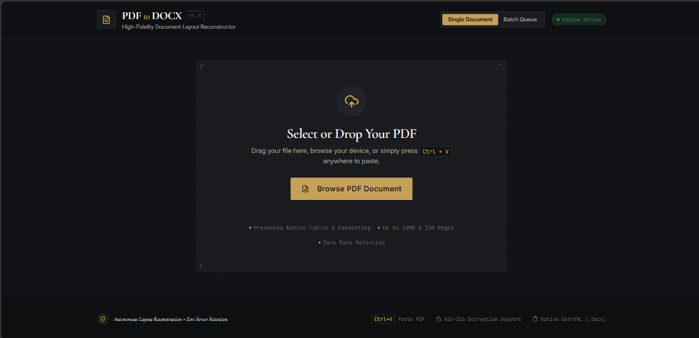
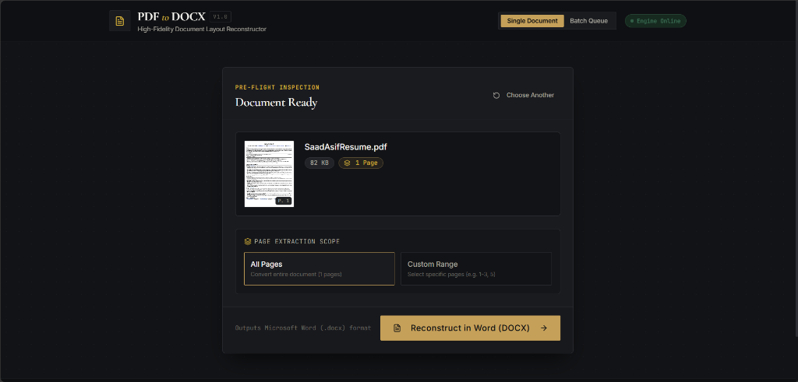
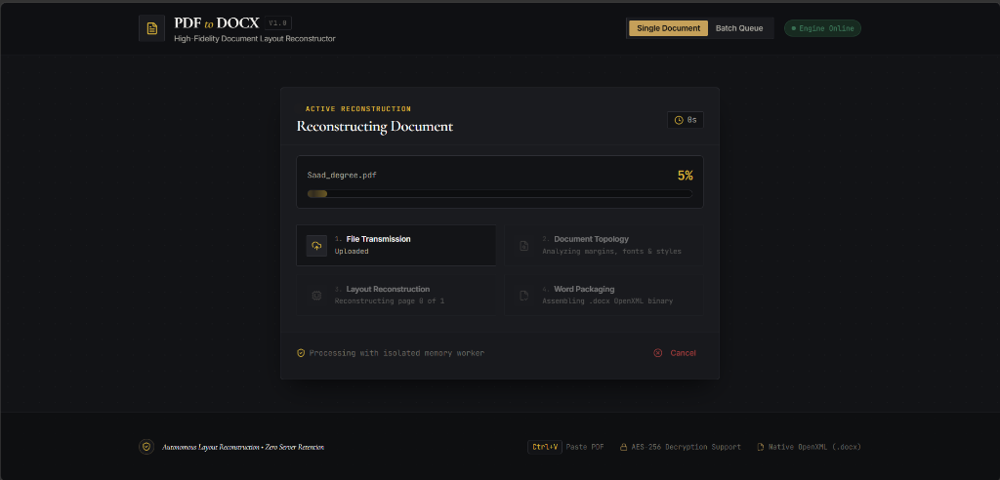
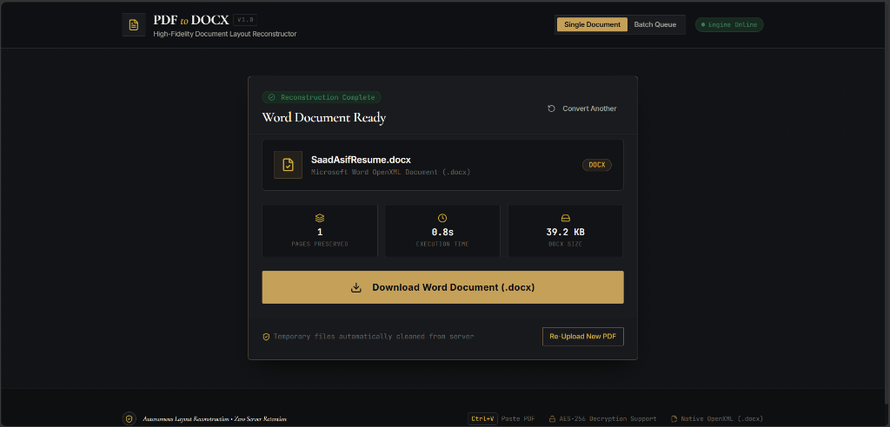
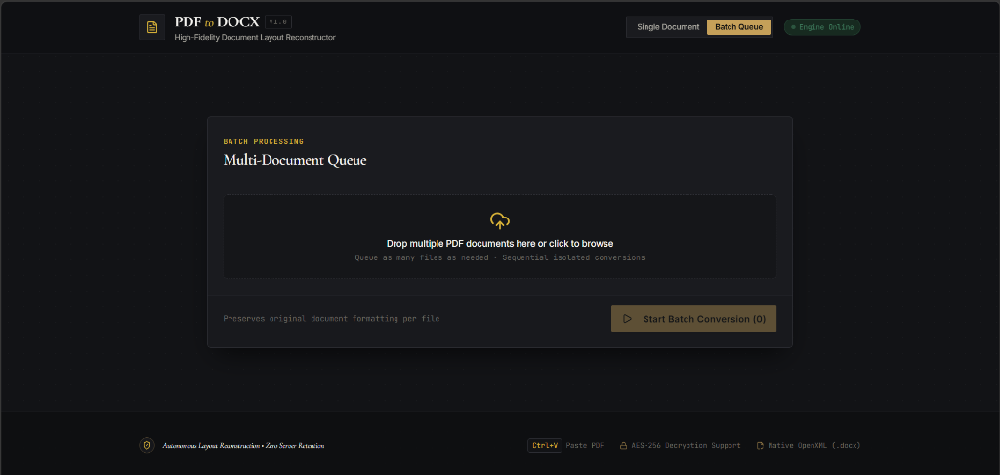

# PDF to DOCX — Editorial Document Reconstructor

A high-performance, layout-preserving **PDF to Word DOCX converter** built with **Python (FastAPI)** and **React (Vite)**, featuring an understated "Old Money" dark editorial interface and privacy-first ephemeral storage.

---

## Visual Showcase

### 1. Ingestion Workspace
Drop a PDF, browse from your computer, or press **`Ctrl + V`** anywhere to paste directly.


### 2. Pre-Flight Inspection & Page Range
Instant Page 1 preview rendered in the browser. Convert all pages or pick a custom range (e.g. `1-3, 5`).


### 3. Real-Time Conversion Progress
Live 4-stage stepper tracking upload, layout topology, page-by-page reconstruction, and Word packaging.


### 4. Word Document Delivery
Download your reconstructed `.docx` file with conversion metrics (page count, speed, and size).


### 5. Multi-Document Batch Queue
Drop multiple PDFs to convert in sequence with individual progress tracking and one-click batch downloads.


---

## Key Features

- **High-Fidelity Layout:** Reconstructs native paragraphs, tables, fonts, formatting, and images into `.docx`.
- **Live Progress Telemetry:** Real-time Server-Sent Events (SSE) provide exact page progress.
- **Client-Side Preflight:** Instant thumbnail and page count extraction using `pdfjs-dist`.
- **Zero Server Retention:** Temporary files are automatically deleted after download with a 15-min background cleanup daemon.
- **Password Support:** Built-in prompt to unlock encrypted PDFs securely.
- **International Filenames:** Full UTF-8 support for accented, Arabic, and Asian document names.

---

## Quick Start

### Option 1: Docker (Single Command)
```bash
docker compose up --build
```
* App: [http://localhost:3000](http://localhost:3000)
* API Docs: [http://localhost:8000/docs](http://localhost:8000/docs)

### Option 2: Local Development

**1. Backend:**
```powershell
cd backend
python -m venv .venv
.venv\Scripts\Activate.ps1
pip install -r requirements.txt
uvicorn app.main:app --reload --port 8000
```

**2. Frontend:**
```powershell
cd frontend
npm install
npm run dev
```
Open [http://localhost:5173](http://localhost:5173).

---

## API Overview

| Method | Endpoint | Description |
| :--- | :--- | :--- |
| `GET` | `/api/v1/health` | Service health & telemetry |
| `POST` | `/api/v1/convert/validate` | PDF preflight inspection |
| `POST` | `/api/v1/convert/stream` | Direct synchronous conversion |
| `POST` | `/api/v1/convert/jobs` | Enqueue async conversion job |
| `GET` | `/api/v1/jobs/{id}/events` | Real-time SSE progress stream |
| `GET` | `/api/v1/jobs/{id}/download` | Download completed `.docx` binary |

---

## Tech Stack

- **Backend:** Python 3.11, FastAPI, `pdf2docx`, PyMuPDF (`fitz`), `pypdf`, `psutil`, `pytest`
- **Frontend:** React 18, Vite 6, Tailwind CSS, `pdfjs-dist`, `framer-motion`, `lucide-react`, Axios
